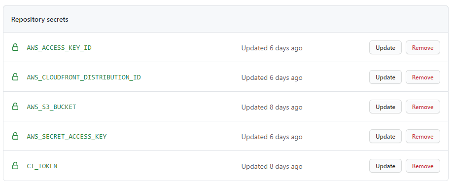

# Deployment with AWS

This document describes how to deploy this project on AWS. It basically follows EMNLP-2020's practice.

We will use the following parts:

1. AWS
2. github
3. RocketChat
4. User management
5. Customizing

## AWS
The website is hosted on AWS. Since it is a totally static website, an efficient approach is ``AWS CloudFront``.

In this section, you will need to
* create IAM account (manage authority)
* SES (Simple Email Service)
* ssl certificate
* Cognito (user pool)
* cloudfront

For an overview how the setup will be, you can refer to [this Amazon blog post](https://aws.amazon.com/de/blogs/networking-and-content-delivery/authorizationedge-using-cookies-protect-your-amazon-cloudfront-content-from-being-downloaded-by-unauthenticated-users/).

    !!! Make sure to deploy everything to us-east-1 !!! 
    
We recommend to do the pipeline IN ORDER.

### IAM Account
1. Go to [IAM configure](https://console.aws.amazon.com/iam/home?region=us-east-1#/home)
2. Goto ``Groups``, create a group called ``aaai2021conf``. Add suitable permission. I recommend to add at least the following permissions:
    * CloudFrontFullAccess (and cloudfront related)
    * Cognito related
    * lambda related
    * S3 related
    
    If you are not confident about the permissions, you can add ``AdministratorAccess`` (although I don't recommend doing that).
3. Goto ``Users``, create a user ``aaai2021user`` belong to ``aaai2021conf`` group. Add all permission in ``aaai2021conf``.
Please note down the user id and password (you can only download when you create).

### SES (Simple Email Service)
1. In ``Email Addresses``, add the email address and verify it.
2. In ``Sending Statistics``, if you find that your SES permission is ``sandbox``, please promote your account's sending limit.
The aws will ask you some questions through support.
3. Send test emails to anyone who is not on the verified ``Email Addresses`` list.

### SSL certificate
Create SSL certificates in [AWS Certificate Manager](https://aws.amazon.com/de/certificate-manager/). 
We create two certificates:
   * virtual.2021.aaai.org
   * signin.2021.aaai.org

Then verify them through domain administrators' email. Please remind them to approve. 

### Cognito
We use Amazon Cognito to manage user accounts. Cognito supports OAuth so that external services like RocketChat can be easily be integrated via SSO.

1. create the user pool ``aaai2021-userpool-serverless``
2. We will write down the basic configures:
    * Required attributes: email
    * Alias attributes: none
    * Username attributes: email
    * Enable case insensitivity?: Yes
    * Minimum password length: 8
    * Password policy: uppercase letters, lowercase letters, numbers
    * User sign ups allowed?: Only administrators can create users
    * FROM email address: Write down the SES role in ``SES (Simple Email Service)``
    * Email Delivery through Amazon SES: Yes
    * MFA: Do not enable
    * Verifications: Email
    * App clients: create ``aaai2021-cognito`` and note down cognito-id and cognito-secret
3. Under Message Customizations, select your mail in the FROM email address ARN, FROM email address and REPLY-TO email address. You can change the templates.
4. In the app client window, make sure to tick Check Enabled Identity Providers -> Cognito User Pool
5. Configure the domain where your signin will be reachable, e.g signin.2021.aaai.org and select the correct certificate. This is not the URL to the virtual conference page itself!
We recommend to keep the ``Amazon Cognito domain`` empty.
6. In Cognito under Domain Name, note down the Alias target. Create a CNAME DNS record for this URL, e.g. signin.2021.aaai.org to d1716jaco5b9so.cloudfront.net (Alias target).
7. Now you can visit the signin website through your custom url. You can upload the conference logo.

### cloudfront

We use the [cloudfront-authorization-at-edge](https://github.com/aws-samples/cloudfront-authorization-at-edge) 
AWS sample. We found it easiest to deploy it via [the Serverless Application Repository](https://console.aws.amazon.com/lambda/home#/create/app?applicationId=arn:aws:serverlessrepo:us-east-1:520945424137:applications/cloudfront-authorization-at-edge).

It will do automatically.

1. Go to [Cloudfront template](https://console.aws.amazon.com/lambda/home#/create/app?applicationId=arn:aws:serverlessrepo:us-east-1:520945424137:applications/cloudfront-authorization-at-edge).

2. Fill the template:

    - Make sure that `Create CloudFront distribution` is set to `true`
    - Make sure that `Enable SPAMode` is set to `false`
    - Remove the `Content-Security-Policy` entry from the `HttpHeaders` JSON object
    - Fill in `UserPoolArn` and `UserPoolClientId`
    - Fill in your domain name in `AlternateDomainNames`, e.g `virtual.2021.aaai.org`

Deploy it and wait until finished (about 10 mins). This creates a S3 bucket and CloudFront distribution for you.

3. Go to [cloudformation](https://console.aws.amazon.com/cloudformation/home?region=us-east-1#/stacks).
You can find your stacks just created. Do ``Update`` and change the IAM role (in the permission) to ``aaai2021``.
4. Go to Output, find ``WebsiteUrl``'s value. You can visit the website through it but find it is a blank page.
5. In ``CloudFront``, add your domain name and select the correct certificate. Create a CNAME DNS record for the distribution URL, e.g. virtual.2021.aaai.org to ``WebsiteUrl``.
Now you can visit it through domain name.

## github
Now you have finished the setup of AWS. You need to add the content to S3 bucket. 
We find it really convenient to synchronize the website with the github repo through ``github action``.

What's more, it needs an additional computer to be the 'communicator' between github and AWS. Since it will be fully 
controlled by others, we recommend creating an ec2 instance in AWS (the cheapest one is ok). You need to write down the 
ssh public key and private key.

This repository comes with an action to build and deploy this repository automatically. To set it up, do the following:
1. add the workflow file:
    * path: .github/workflows/deploy_aws.yaml
    * content: see [configure file](https://github.com/teddylfwu/AAAI21-Virtual-Conference/blob/develop/.github/workflows/deploy_aws.yaml).
    You may need to change the branch from ``develop`` to yours.
2. Go to ``Action`` in github repo page, you can find the workflow.
3. Go to ``Setting``, then ``Deploy keys``. Add the ssh public key and enable ``Allow write access``:
    * name: ec2, value: public_key
4. Go to ``Setting``, then ``Secrets``, create the following five secrets

This repository comes with an action to build and deploy this repository automatically. To set it up, do the following:
   * name: AWS_ACCESS_KEY_ID, value: aws role's key id
   * name: AWS_SECRET_ACCESS_KEY, value: aws role's secret
   * name: AWS_CLOUDFRONT_DISTRIBUTION_ID, value: cloudfront's ID
   * name: CI_TOKEN, value: ssh private key
   * name: AWS_S3_BUCKET: value: aws S3's url, eg: s3://serverlessrepo-aaai2021-s3bucket-1gv17xyhbpiy4

  

Submit a commit to the branch and you can find the building works. After building, you can visit the website's domain name.
You can find your website show the correct pages.

Please refer to [key-value file](https://github.com/teddylfwu/AAAI21-Virtual-Conference/blob/develop/doc/aaai-2021-practice/img/key-value.txt).

## RocketChat

See https://github.com/acl-org/acl-2020-virtual-conference/issues/53

## User management
We develop some tools based on emnlp-2020 to manage users.

Now it supports:
   * create users in batch
   * export all users (only emails)
   * reset a specific password for user

Please see this part's [README.md](https://github.com/teddylfwu/AAAI21-Virtual-Conference/blob/develop/tools/aws/cognito/README.md)

## Customizing

There are many things that you can customize after you have the initially setup running. We describe a few here.

### Change signup logo   

To customize sign-in UI, in Cognito, go to `App integration -> UI customization`. Choose the `App client to customize`.
Upload the logo you want to use.
   
### Password strength

We recommend to reduce the default password strength to e.g. just numbers and letters. Special characters have been
very confusing for people. 

### Invitation mails

See https://github.com/acl-org/emnlp-2020-virtual-conference/issues/21 . 

### When loading my website, some parts do not load and I get errors about the content security policy

You forgot to remove the `Content-Security-Policy` entry from the `HttpHeaders` JSON object when rolling out the
application. Go to the [AWS Lambda application dashboard](https://console.aws.amazon.com/lambda/home?region=us-east-1#/applications),
select the right application. Find the `HttpHeadersHandler` lambda and open it. In the editor, open `configuration.json`,
remove the line with `Content-Security-Policy`. Then redeploy the lambda via `Save`, `Action -> Publish New Version`, then
`Action -> Deploy to Lambda@Edge`.

