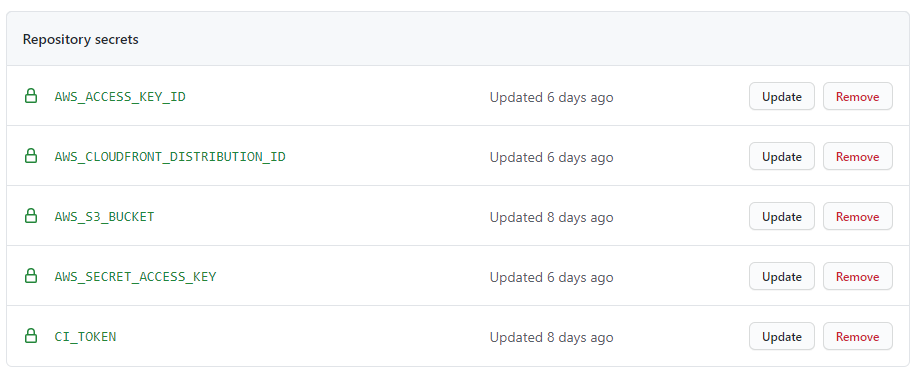

# Depyloment with AWS

This document describes how to deploy this project on AWS. We will use the following parts:

1. Python + Flask Frozen to create a static site that only needs a HTTP server to be deployed
2. Github for hosting the repository and automatic deployment via Github actions. We assume that this repository is private.
3. Amazon S3 to host the static site and related assets that are not in the Github repo, like paper PDFs
4. Amazon CloudFront to deliver the static site in the S3 bucket via the Amazon CDN
5. Amazon Cognito for user authentication and SSO so that the conference page is behind a paywall
6. A domain for which you control the DNS entries for
7. RocketChat for chat during the conference

## Github

Create a new empty repository or fork the repository of the most recent conference. If you start from an empty repository,
copy the repo from the last conference, delete large files that you do not need and push it to the new remote. 

## AWS

You will need an IAM account with enough rights to create things in the AWS management console. We will also create a user
that only has access to the S3 bucket and cloudfront distribution for automatic deployment via Github actions.

We will setup an S3 bucket that will host the static assets, CloudFront to distribute it and Cognito + Lambda@Edge
for the authentication.

For an overview how the setup will be, you can refer to [this Amazon blog post](https://aws.amazon.com/de/blogs/networking-and-content-delivery/authorizationedge-using-cookies-protect-your-amazon-cloudfront-content-from-being-downloaded-by-unauthenticated-users/).

    !!! Make sure to deploy everything to us-east-1 !!! 
    
### Get SSL certificate for your domain

Create a SSL certificate in [AWS Certificate Manager](https://aws.amazon.com/de/certificate-manager/) . We recommend
that you create a wildcard certificate, e.g. if your page will be reachable under `virtual.emnlp.2020.org`,
create a certificate for `*.emnlp.2020.org`. Follow the steps for validating it, e.g. via DNS entries.

### Setup Cognito

We use Amazon Cognito to manage user accounts. Cognito supports OAuth so that external services like RocketChat
can be easily be integrated via SSO.

1. In the AWS management console, create a user pool and write down the user pool ARN. 
2. For the pool, create a new app client and write down the app client id.
3. In the app client window, make sure to tick *Check Enabled Identity Providers -> Cognito User Pool*
4. Configure the domain where your signup will be reachable, e.g `signup.emnlp.2020.org` and select the correct certificate.
   This is not the URL to the virtual conference page itself!

## Deploy S3 + CloudFront + Authentication

We use the [cloudfront-authorization-at-edge](https://github.com/aws-samples/cloudfront-authorization-at-edge) 
AWS sample. We found it easiest to deploy it via [the Serverless Application Repository](https://console.aws.amazon.com/lambda/home#/create/app?applicationId=arn:aws:serverlessrepo:us-east-1:520945424137:applications/cloudfront-authorization-at-edge).

When choosing Option 1, please note the following:

- Make sure that `Create CloudFront distribution` is set to `true`
- Make sure that `Enable SPAMode` is set to `false`
- Remove the `Content-Security-Policy` entry from the `HttpHeaders` JSON object
- Fill in `UserPoolArn` and `UserPoolClientId`
- Fill in your domain name in `AlternateDomainNames`, e.g `virtual.emnlp.2020.org`

Deploy it and wait until finished. This creates a S3 bucket and CloudFront distribution for you.

## Setting up DNS entries

1. In CloudFront, add your domain name and select the correct certificate. Create a CNAME DNS record for the
   distribution URL, e.g. `virtual.2020.emnlp.org` to `sd98f7s9dfsdf.cloudfront.net`
2. In Cognito under `Domain Name`, note down the `Alias target`. Create a CNAME DNS record for this
   URL, e.g. `signup.2020.emnlp.org` to `d1716jaco5b9so.cloudfront.net`
   
Wait a bit until the DNS records have propagated. Now you can create a test user in Cognito and trying to log 
into your website, e.g. `virtual.2020.emnlp.org`! It should greet you with a dummy website. If not, refer to the 
`Troubleshooting` section of this guide!

## Setting up Mail

We will use a dedicated email address that sends invitations. Users can reply to this mail in case they have problems.
To do that, first go to [Amazon SES](https://console.aws.amazon.com/ses) and create and verify your address.

Then go to AWS Cognito, under `Message Customizations`, select your mail in the `FROM email address ARN`, `FROM email address`
and `REPLY-TO email address`. You can change the display name by using e.g. `EMNLP 2020 Virtual Conference <virtual.2020@emnlp.org>`
as the `FROM email address`.

Users will use this mail then when asking for help so you should closely monitor this address. 

## Autodeploy via Github Actions

This repository comes with an action to build and deploy this repository automatically. To set it up, do the following:

1. Create a SSH key pair locally
2. In the repository settings under `Deploy keys`, add the just generated public key
3. In the repository settings under `Secrets`, create the following secrets:

  

The `CI_TOKEN` is the private key of the SSH key pair you just created. `AWS_ACCESS_KEY_ID` and `AWS_SECRET_ACCESS_KEY`
are the API credentials for a AWS user. We strongly recommend that you create a user that only has rights for the CloudFront
distribution and the S3 bucket. The other entries should be self-explanatory. 

When you push now to master or merge a PR into master, then the code should be built and automatically deployed to your
S3 bucket. Thne the CloudFront distribution will be invalidated to quickly update the website.

## RocketChat integration

See https://github.com/acl-org/acl-2020-virtual-conference/issues/53

## Customizing

There are many things that you can customize after you have the initially setup running. We describe a few here.

### Change signup logo   

To customize sign-in UI, in Cognito, go to `App integration -> UI customization`. Choose the `App client to customize`.
Upload the logo you want to use.
   
### Password strength

We recommend to reduce the default password strength to e.g. just numbers and letters. Special characters have been
very confusing for people. 

### Invitation mails

See https://github.com/acl-org/emnlp-2020-virtual-conference/issues/21 . 

## Trouble Shooting

### When loading my website, some parts do not load and I get errors about the content security policy

You forgot to remove the `Content-Security-Policy` entry from the `HttpHeaders` JSON object when rolling out the
application. Go to the [AWS Lambda application dashboard](https://console.aws.amazon.com/lambda/home?region=us-east-1#/applications),
select the right application. Find the `HttpHeadersHandler` lambda and open it. In the editor, open `configuration.json`,
remove the line with `Content-Security-Policy`. Then redeploy the lambda via `Save`, `Action -> Publish New Version`, then
`Action -> Deploy to Lambda@Edge`.

